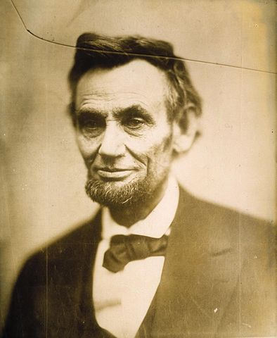

## fiction

 * Lincoln in the Bardo, by George Saunders
 
 > In this they can be like wild dogs let into a slaughterhouse--racing about upon the spilled blood, driven mad by the certainty that some sort of satisfaction must be near at hand.

 > A train approaches a wall at a fatal rate of speed. You hold a switch in your hand, that accomplishes you know not what: do you throw it? Disaster is otherwise assured. It costs you nothing. Why not try?

 > Oh, the pathos of it!--haggard, drawn into fixed lines of unutterable sadness, with a look of loneliness, as of a soul whose depth of sorrow and bitterness no human sympathy could ever reach. The impression I carred away was that I had seen, not so much the President of the United States, as the saddest man in the world. - Francis F. Browne. "The Every-Day Life of Abraham Lincoln: A Biography of the Great American President from an Entirely New Standpoint, with Fresh and Invaluable Material," account of Rev. George C. Noyes.

 * An Artist of the Floating World, by Kazuo Ishiguro
 * Waiting, by Ha Jin
 * Inland, by Téa Obreht
 * Less, by Andrew Sean Greer
 * Pachinko, by Min Jin Lee
 * Normal People, by Sally Rooney
 * A Fine Balance, by Rohinton Mistry
 * Exit West, by Mohsin Hamid
 

## non-fiction

 * Talking to Strangers, by Malcom Gladwell

